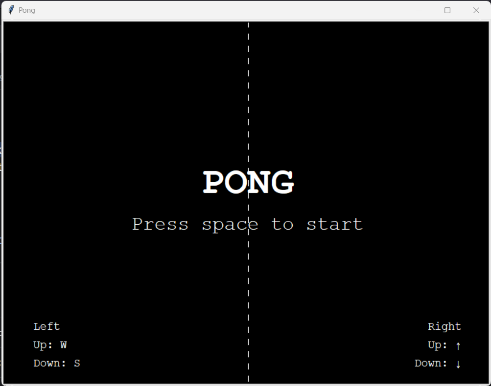
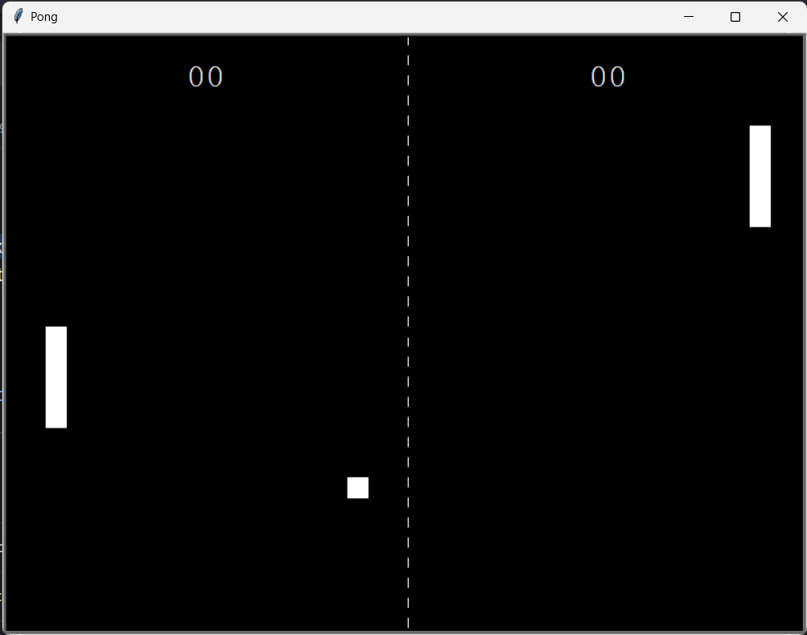

# Decription
Pong, the classic two-player arcade game, implemented in Python using the Turtle graphics library 

## Features
Player Interaction:
- Two players can control their respective paddles using keyboard inputs.
- The left paddle is controlled by 'W' (up) and 'S' (down) keys, while the right paddle is controlled by the arrow keys.

Responsive Ball Movement:
- The ball moves dynamically, bouncing off walls and paddles with realistic physics.
- The speed of the ball may increase or decrease during gameplay, adding an element of challenge.

Score Tracking:
- The game keeps track of each player's score, updating it whenever a player successfully scores a point.

## How to Play
Players control their paddles to hit the ball, aiming to outmaneuver their opponent and score points. The game continues until a predetermined score limit is reached, at which point the player with the highest score is declared the winner.

## Screenshots
- Main Menu

- Gameplay

